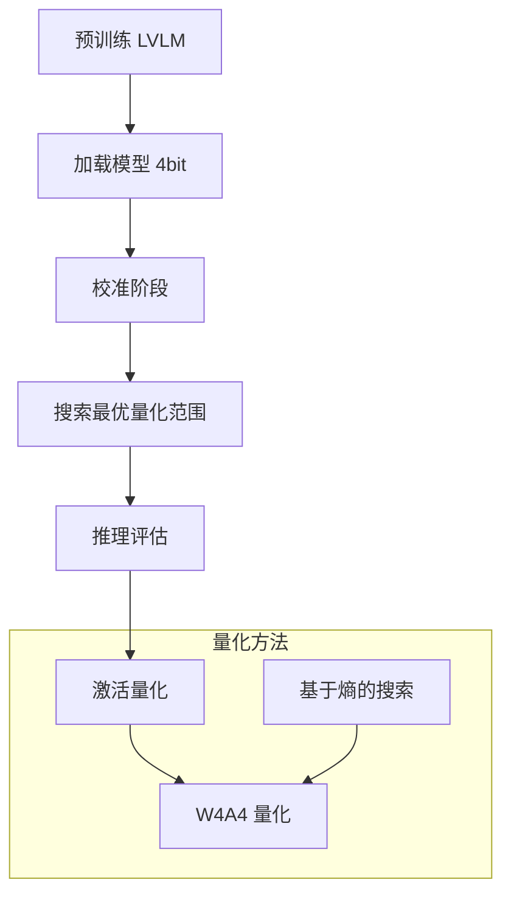

# Q-VLM 项目结构分析文档

## 1. 项目概述

**Q-VLM** (Quantization for Large Vision-Language Models) 是一个用于大型视觉-语言模型后训练量化的框架，实现 W4A4 (4-bit 权重 + 4-bit 激活) 量化方法，发表于 NeurIPS'24。

### 核心特性
- **W4A4 量化**: 权重和激活都使用 4-bit 量化
- **非对称量化**: 使用 `asymmetric_linear_quantization_params()` 计算 scale 和 zero-point
- **动态激活范围搜索**: 基于熵的搜索策略 (DED - Distribution Entropy Difference)

---

## 2. 项目目录结构

```
qvlm/
├── llava/                    # 核心模型代码 (基于 LLaVA)
│   ├── model/               # 模型架构
│   │   ├── builder.py      # 模型加载器 (支持 4bit/8bit 量化)
│   │   ├── llava_arch.py   # 视觉-语言模型架构基类
│   │   ├── language_model/ # 语言模型 (LLaMA, MPT)
│   │   ├── multimodal_encoder/ # 视觉编码器 (CLIP)
│   │   └── multimodal_projector/ # 投影层
│   ├── train/              # 训练代码
│   │   ├── train.py        # 主训练脚本
│   │   └── llava_trainer.py
│   ├── eval/               # 评估代码
│   │   ├── model_vqa_science.py  # ScienceQA 评估 (含校准流程)
│   │   └── model_vqa.py     # VQA 评估
│   ├── serve/              # 服务部署 (Gradio)
│   └── constants.py, conversation.py, mm_utils.py  # 工具函数
│
├── custom_bitsandbytes/    # 自定义量化库 (核心创新)
│   ├── bitsandbytes/
│   │   ├── functional.py   # 量化前向/反向传播
│   │   ├── quantization_utils/
│   │   │   ├── quant_modules.py  # QuantAct 模块 (激活量化)
│   │   │   └── quant_utils.py    # 量化工具函数
│   │   ├── nn/modules.py   # 量化 Linear 层
│   │   └── autograd/_functions.py # 量化算子
│   └── csrc/               # CUDA 核心计算
│
├── scripts/                # 实验脚本
│   ├── generate_sqa_response.sh   # 生成 ScienceQA 响应
│   ├── evaluate_sqa_response.sh   # 评估响应
│   └── finetune*.sh       # 微调脚本
│
└── docs/                   # 文档
```

---

## 3. 核心代码文件

### 3.1 核心量化实现

| 文件 | 功能 | 关键类/函数 |
|------|------|------------|
| `custom_bitsandbytes/bitsandbytes/quantization_utils/quant_modules.py` | 激活量化模块 | `QuantAct` 类 |
| `custom_bitsandbytes/bitsandbytes/quantization_utils/quant_utils.py` | 量化工具函数 | `AsymmetricQuantFunction`, `linear_quantize` |
| `custom_bitsandbytes/bitsandbytes/functional.py` | 量化算子实现 | 8bit/4bit 优化器、矩阵乘法 |

### 3.2 量化集成入口

| 入口文件 | 作用 |
|---------|------|
| `llava/eval/model_vqa_science.py` | 导入 `QuantAct`，校准流程 |
| `llava/model/builder.py` | 4bit 模型加载配置 |

---

## 4. 实验脚本说明

### 4.1 generate_sqa_response.sh

生成量化模型的预测答案 (带校准流程):

```bash
CUDA_VISIBLE_DEVICES=0 python -m llava.eval.model_vqa_science \
    --model-path <model-path> \
    --question-file /<path>/ScienceQA/data/scienceqa/llava_test_QCM-LEPA.json \
    --image-folder /<path>/ScienceQA/data/scienceqa/images/test \
    --question-file-calibrate /<path>/ScienceQA/data/scienceqa/llava_train_QCM-LEPA.json \
    --image-folder-calibrate /<path>/ScienceQA/data/scienceqa/images/train \
    --answers-file /<path>/LLaVA/results/ScienceQA/LLaVA-vicuna-7B-v1.3-4bit.jsonl \
    --conv-mode llava_v1 \
    --load-4bit
```

**参数说明**:
- `--model-path`: 预训练 LLaVA 模型路径
- `--question-file`: 测试集问题文件
- `--question-file-calibrate`: 校准集 - 用于确定量化范围
- `--load-4bit`: 启用 4-bit 量化

### 4.2 evaluate_sqa_response.sh

评估模型生成的答案并计算准确率:

```bash
python ../llava/eval/eval_science_qa.py \
    --base-dir /<path>/ScienceQA/data/scienceqa \
    --result-file /<path>/LLaVA/results/ScienceQA/LLaVA-vicuna-7B-v1.3-4bit.jsonl \
    --output-file /<path>/LLaVA/results/ScienceQA/test_llava-7b_output.json \
    --output-result /<path>/LLaVA/results/ScienceQA/test_llava-7b_result.json
```

---

## 5. Q-VLM 核心方法

### 5.1 激活量化 (QuantAct)

文件: `custom_bitsandbytes/bitsandbytes/quantization_utils/quant_modules.py`

```python
class QuantAct(Module):
    """激活量化模块 - 核心类"""
    def __init__(self, activation_bit=16, input_dim=4096, ...):
        # 量化参数初始化
        self.activation_bit = activation_bit
        self.llama_range_min/max = ...  # 动态范围
```

### 5.2 熵基搜索策略

文件: `custom_bitsandbytes/bitsandbytes/quantization_utils/quant_modules.py`

```python
def compute_DED(self, p_k, p_k1):
    """Distribution Entropy Difference - 核心创新"""
    return -1 * torch.sum(joint_p * torch.log(condition_p), dim=1).mean()

def cal_entropy(self, attn):
    """熵计算"""
    return -1 * torch.sum((attn * torch.log(attn+1e-7)), dim=1).mean()
```

### 5.3 量化/反量化函数

文件: `custom_bitsandbytes/bitsandbytes/quantization_utils/quant_utils.py`

```python
def linear_quantize(input, scale, zero_point):  # 量化
def linear_dequantize(input, scale, zero_point):  # 反量化
def asymmetric_linear_quantization_params(num_bits, saturation_min, saturation_max):  # 计算scale/zero-point
```

---

## 6. 工作流程图

### 量化推理流程

```
1. generate_sqa_response.sh
   └─> model_vqa_science.py
       ├─ 加载 4bit 量化模型
       ├─ run_calibrate() ← 使用训练集校准激活范围
       └─ 推理测试集 → 预测答案 → JSONL 文件

2. evaluate_sqa_response.sh
   └─> eval_science_qa.py
       ├─ 读取预测结果
       ├─ 与标准答案对比
       └─ 输出准确率 → JSON 文件
```

### 量化方法流程



---

## 7. 安装与使用

### 7.1 安装依赖

```bash
# 1. 安装基础包
pip install -e .

# 2. 安装自定义量化库
pip uninstall bitsandbytes
cd custom_bitsandbytes
python setup.py install
```

### 7.2 运行实验

```bash
# 生成答案 (含校准)
sh scripts/generate_sqa_response.sh

# 评估结果
sh scripts/evaluate_sqa_response.sh
```

---

## 8. 相关链接

- [Q-VLM 论文](https://arxiv.org/abs/2410.08119)
- [LLaVA 项目](https://github.com/haotian-liu/LLaVA)
- [bitsandbytes](https://github.com/bitsandbytes-foundation/bitsandbytes)

---

*文档生成时间: 2024*
